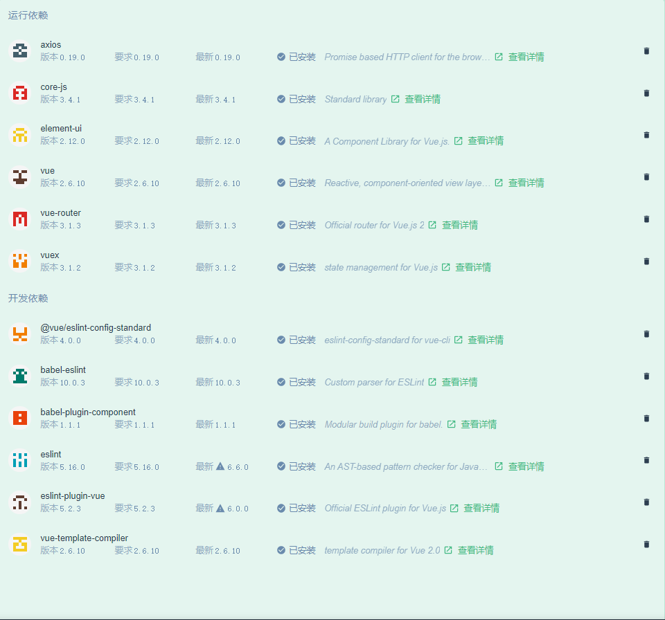
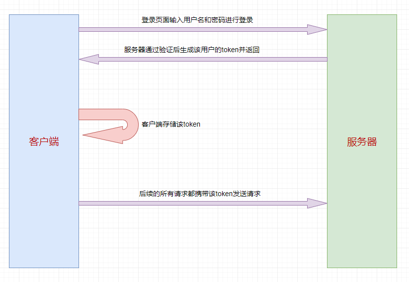
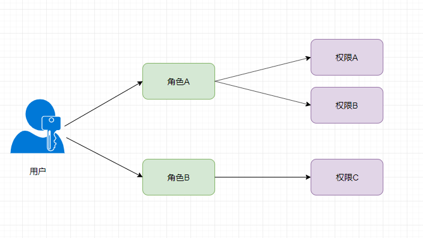

## 电商后台管理系统(前端项目)

### 功能

> 用于管理用户账号，商品分类，商品信息，订单，数据统计等业务功能


### 开发模式

> 电商后台管理系统整体采用前后端分离的开发模式,其中前端项目是基于Vue技术栈的SPA项目


### 技术选型

#### 前端项目技术栈

- Vue
- Vue-router
- Element-UI
- Axios
- Echarts

#### 后端项目技术栈

- Node.js
- Express
- Jwt
- Mysql
- Sequelize

### 项目初始化

#### 前端项目初始化步骤

1. 安装 Vue 脚手架
2. 通过 Vue-Cli 创建项目
3. 配置 Vue-router
4. 配置 Element-UI 组件库
5. 配置 Axios 库
6. 初始化 git 远程仓库

##### 相关依赖-按需导入



#### 后端项目的环境安装配置

1. 安装MySQL数据库
2. 安装Node.js环境
3. 配置项目相关信息
4. 启动项目
   1. 使用phpstudy导入数据库并运行
   2. npm init 后端项目
   3. node ./app.js
5. 使用Postman测试后台项目接口是否正常

### 登录概述

#### 登录业务流程

1. 在登录页面输入用户名和密码
2. 调用后台接口进行验证
3. 通过验证之后,根据后台的响应状态跳转到项目主页

#### 登录业务相关技术点

1. http是无状态的
2. 通过cookie在客户端记录状态
3. 通过sesion在服务器端记录状态
4. 通过token维持状态(不允许跨域使用)



#### 登录业务流程

##### 登录页面的布局

通过Element-UI组件实现布局

- el-form
- el-form-item
- el-input
- el-button
- 字体图标

##### 创建git分支

```
// 创建并切换登录分支
git checkout -b login

// login分支合并到主分支
// 1.切换到master分支
git checkout master
// 2.合并分支到master
git merge login

// 将本地login子分支推送到github
git push -u origin login
```

##### 路由导航守卫控制访问权限

> 如果用户没有登录,但是直接通过URL访问特定页面,需要重新导航到登录页面

```js
//为路由对象,添加beforeEach导航守卫
router.beforeEach((to,from,next) => {
    //如果用户访问的登录页,直接放行
    if (to.path === 'login') return next()
    //从sessionStorage中获取到保存的token值
    const tokenStr = window.sessionStorage.getItem('token')
    //如果么有token,强制跳转到登录页
    if(!tokenStr) return next('/login')
    next()
})
```

### 主页布局

#### 通过接口获取菜单数据

> 通过axios请求拦截器添加token,保证拥有获取数据的权限

```js
// axios请求拦截
axios.interceptors.request.use(config => {
    // 为请求头对象,添加token验证的Authorization字段
    config.headers.Authorization = window.sessionStorage.getItem('token')
    return config
})
```
### 权限管理

#### 权限管理业务分析

> 通过权限管理模块控制不同的用户可以进行哪些操作,具体可以通过角色的方式进行控制,即每个用户分配一个特定的角色,角色包括不同的功能权限




### 分类管理

#### 商品分类概述

> 商品分类用于在购物时,快速找到需要购买的商品,进行直观显示


---

[接口API](./api接口文档.md)
